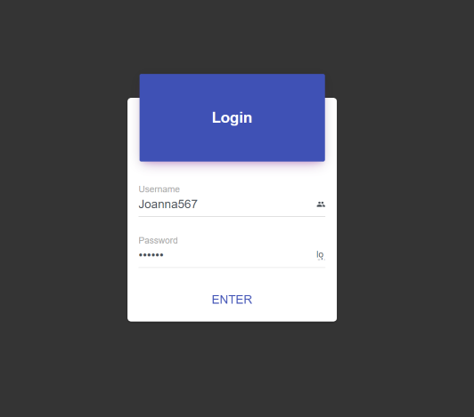
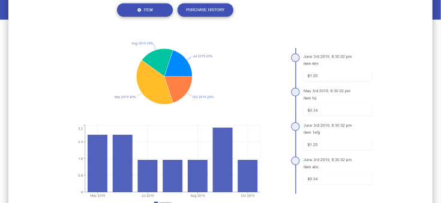
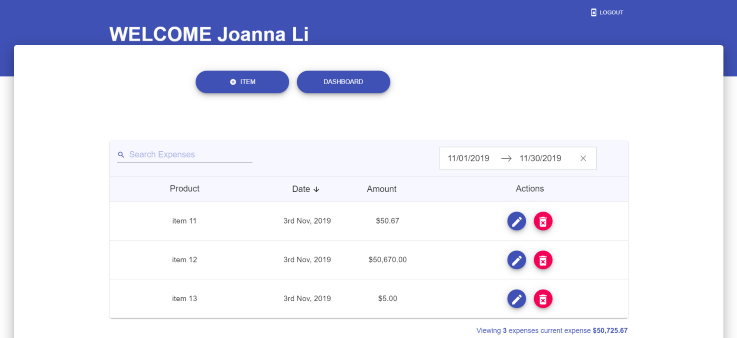
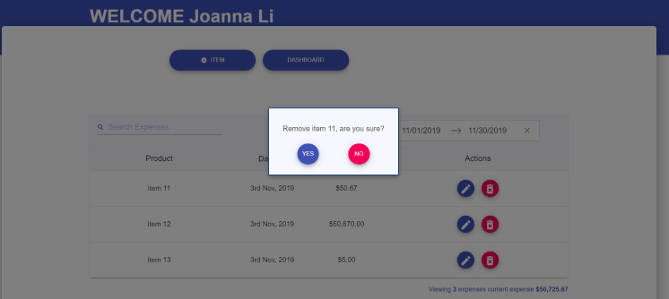
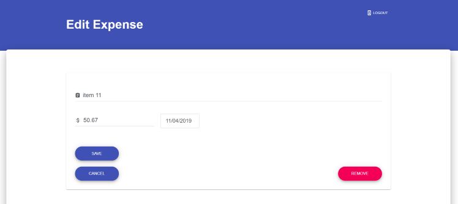

# react-redux-app-demo

> A resuable product list project based on React 16, Redux and Material UI

The purpose of this project is to assist business to create records for product procuments, including a barchart displying monthly total spending over last 7 months, percentage quantitative comparison piechart on spending over last 4 months and timeline display of the recent purchases.

### Live Demo
[Demo](https://react16-buget-app.herokuapp.com)


### Features
- This project is built using React/Redux
- UI of the project used Material UI
- Routing of the project uses react router hence all client side rendering

## Getting Started
Below are the steps to get the project running on local machine for development and testing purpose

### Prerequisites
Get [npm](https://www.npmjs.com/get-npm) or [yarn](https://yarnpkg.com/lang/en/docs/install/#windows-stable) installed in your local machine


### Build Setup

```bash
# Clone project
git clone git@github.com:qyli8/react-redux-app-demo.git


# install the packages with npm
cd react-redux-app-demo
npm install

# start the server at localhost:8080
npm run dev-server
# or yarn
yarn run dev-server

## you might see below output
#i ｢wds｣: Project is running at http://localhost:8080/
#i ｢wds｣: webpack output is served from /dist/
#i ｢wds｣: 404s will fallback to /index.html
#i ｢wdm｣: Hash: 99b239a9632db4d1a630
#Version: webpack 4.3.0
#Time: 20056ms
#Built at: 11/3/2019 5:41:02 PM
#     Asset      Size  Chunks             Chunk Names
#styles.css  74.4 KiB    main  [emitted]  main
# bundle.js  15.6 MiB    main  [emitted]  main

## development
npm run demo
# or yarn
yarn demo

## build for dev
npm run build

## build for production
npm run prod-build
```


## Screenshots











